# Advanced chart catalog

Liveline includes 21 advanced chart families in addition to its original real-time, statistical, categorical, hierarchy, and flow charts. Each family has a dedicated `LivelineChart` initializer, typed data, a typed style, native scrubbing/tooltips, VoiceOver inspection, Audio Graph output, Dynamic Type-aware labels, and standard or Dither rendering.

## Choosing a chart

| Chart | Initializer label | Data type | Use it for | Horizontal domain |
| --- | --- | --- | --- | --- |
| Violin | `violin:` | `LivelineDistributionSeries` | Comparing full distributions, quartiles, and medians | Categories |
| Ridgeline | `ridgeline:` | `LivelineDistributionSeries` | Comparing shifts across several distributions | Numeric value |
| Calendar heatmap | `calendarHeatmap:` | `LivelineCalendarValue` | Daily activity and seasonality | Civil weeks |
| Gantt | `gantt:` | `LivelineGanttTask` | Schedules, completion, and dependencies | Time |
| Chord | `chord:` | `LivelineChordLink` | Weighted relationships among a small set of groups | Radial categories |
| Parallel coordinates | `parallelCoordinates:` | `LivelineParallelRecord` | Comparing multivariate records | Quantitative axes |
| Hexbin | `hexbin:` | `LivelineXYPoint` | Dense two-dimensional observations | Numeric X |
| Bump | `bump:` | `LivelineRankSeries` | Rank changes and crossings over time | Time |
| Horizon | `horizon:` | `LivelinePoint` | Compact positive and negative deviations | Time |
| Marimekko | `marimekko:` | `LivelineMarimekkoColumn` | Two proportional dimensions at once | Weighted categories |
| Polar area | `polarArea:` | `LivelineCategoryValue` | Cyclic or radial category magnitude | Radial categories |
| Network | `networkNodes:edges:` | `LivelineNetworkNode`, `LivelineNetworkEdge` | Small deterministic topologies | Spatial nodes |
| Contour | `contour:` | `LivelineContourSample` | Scalar fields and level boundaries | Numeric X and Y |
| Ternary | `ternary:` | `LivelineTernaryPoint` | Three-part compositions | Barycentric components |
| Waffle | `waffle:` | `LivelineCategoryValue` | Part-to-whole counts with discrete cells | Categories |
| Volume profile | `volumeProfile:` | `LivelinePriceVolume` | Traded volume by price level | Price levels |
| Renko | `renko:` | `LivelinePoint` | Price moves independent of elapsed time | Derived brick order |
| Heikin-Ashi | `heikinAshi:` | `LivelineCandle` | Smoothed OHLC trend reading | Time |
| Market depth | `marketDepth:` | `LivelineOrderBookLevel` | Cumulative bid and ask liquidity | Price |
| OHLC + volume | `ohlcVolume:` | `LivelineCandleVolume` | Synchronized price and traded-volume panes | Time |
| Point-and-figure | `pointAndFigure:` | `LivelinePoint` | Box-reversal price structure independent of time | Derived column order |

Renko and point-and-figure intentionally use ordinal horizontal placement. They do not display a time axis because multiple derived marks may come from one source timestamp. Horizon charts keep their time axis but omit a Cartesian value axis because folded bands encode magnitude relative to a shared baseline rather than literal vertical position.

## Distribution and planning

```swift
LivelineChart(
    violin: cohorts,
    style: LivelineViolinStyle(
        bandwidth: nil,
        showsMedian: true,
        showsQuartiles: true,
        colors: [.blue, .purple, .cyan]
    )
)

LivelineChart(
    calendarHeatmap: dailyActivity,
    style: LivelineCalendarHeatmapStyle(
        calendar: calendar,
        colorScale: [.teal, .green]
    )
)

LivelineChart(
    gantt: releaseTasks,
    style: LivelineGanttStyle(showsProgress: true, showsDependencies: true),
    configuration: LivelineChartConfiguration(padding: LivelinePadding(left: 72))
)
```

Distribution series discard non-finite samples. Gantt tasks normalize reversed intervals, negative lanes, and progress outside `0...1`.

## Relationships and multivariate data

```swift
LivelineChart(
    chord: collaboration,
    style: LivelineChordStyle(innerRadiusRatio: 0.72, ribbonOpacity: 0.34)
)

LivelineChart(
    parallelCoordinates: candidates,
    style: LivelineParallelCoordinatesStyle(
        axisLabels: ["Speed", "Cost", "Safety", "Scale", "DX"]
    )
)

LivelineChart(
    networkNodes: services,
    edges: dependencies,
    style: LivelineNetworkStyle(layout: .radial)
)

LivelineChart(
    ternary: workloads,
    style: LivelineTernaryStyle(axisLabels: ["Compute", "Storage", "Network"])
)
```

Chord and network graphs are intended for readable, bounded relationship sets rather than thousands of nodes or links. Network placement is deterministic: `.radial` preserves input order around a circle and `.grid` uses a stable row-major grid.

## Density, rank, and proportion

```swift
LivelineChart(hexbin: observations, style: LivelineHexbinStyle(binsAcross: 20))

LivelineChart(
    bump: rankings,
    style: LivelineBumpStyle(lowerRankIsBetter: true, showsEndLabels: true)
)

LivelineChart(
    marimekko: regionalMix,
    style: LivelineMarimekkoStyle(showsLabels: true, showsValues: true)
)

LivelineChart(
    contour: scalarField,
    style: LivelineContourStyle(levelCount: 7, showsFill: true)
)

LivelineChart(waffle: planMix, style: LivelineWaffleStyle(columns: 10, rows: 10))
```

Hexbin aggregates observations before drawing, which avoids unreadable overplotting. Contour rendering bilinearly subdivides the supplied regular field and traces level boundaries with marching squares. Waffle allocation uses the largest-remainder method so its cell count always matches the configured grid.

## Financial charts

```swift
LivelineChart(
    volumeProfile: volumeByPrice,
    style: LivelineVolumeProfileStyle(showsPointOfControl: true, showsValues: true)
)

LivelineChart(
    renko: closes,
    style: LivelineRenkoStyle(brickSize: 1.0, showsWicks: false)
)

LivelineChart(heikinAshi: candles, style: LivelineHeikinAshiStyle())

LivelineChart(
    marketDepth: levels,
    style: LivelineMarketDepthStyle(showsSpread: true, showsMidPrice: true)
)

LivelineChart(
    ohlcVolume: intervals,
    style: LivelineOHLCVolumeStyle(volumeHeightRatio: 0.24)
)

LivelineChart(
    pointAndFigure: closes,
    style: LivelinePointAndFigureStyle(boxSize: 1.0, reversalBoxes: 3)
)
```

Renko bricks, Heikin-Ashi candles, cumulative depth curves, and point-and-figure columns are derived deterministically from normalized input. `brickSize` and `boxSize` must express the same unit as the source values; non-positive or non-finite sizes safely resolve to `1`. Point-and-figure reversal is clamped to `1...10` boxes.

## Interaction and accessibility

Every advanced chart participates in the same Liveline interaction surface:

- Drag or hover resolves the nearest meaningful mark, cell, segment, node, task, brick, or column.
- VoiceOver exposes the chart kind, summary, and adjustable per-datum inspection.
- Audio Graph exposes continuous time series where time is meaningful and categorical series for ordinal, radial, or multivariate charts.
- Host-provided `formatValue` and `formatTime` closures are used by visible labels, tooltips, VoiceOver, and derived financial descriptions.
- Liveline-provided chart names, tooltip labels, VoiceOver phrases, and Audio Graph series names are localized in English and Spanish.

Use concise labels, avoid encoding meaning by color alone, and keep `formatValue` explicit about units. The standard and Dither styles share geometry, hit targets, accessibility, and data semantics.

## Screenshots

Deterministic chart-only captures for all 21 families live in [`Media/storybook-new-charts`](../Media/storybook-new-charts). The authoritative scenario IDs and coverage descriptions are in the [scenario matrix](ScenarioMatrix.md).

| Distribution and planning | Relationships and density | Financial and proportional |
| --- | --- | --- |
|  | 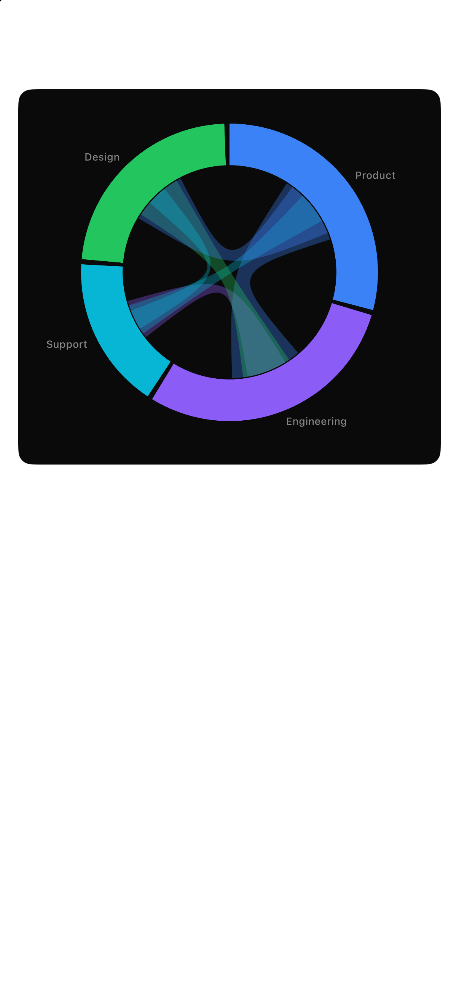 | 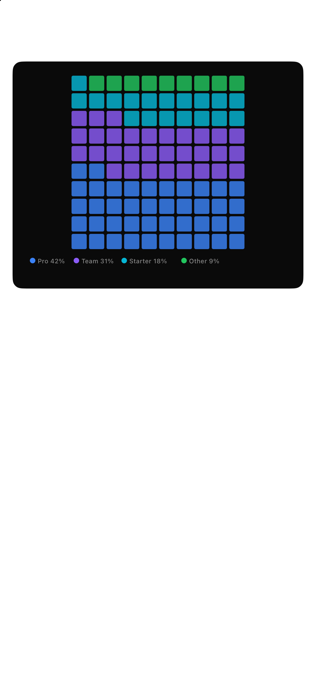 |
| 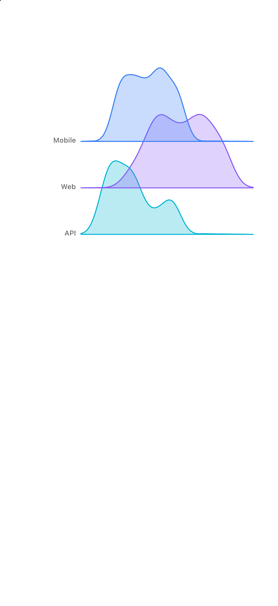 | 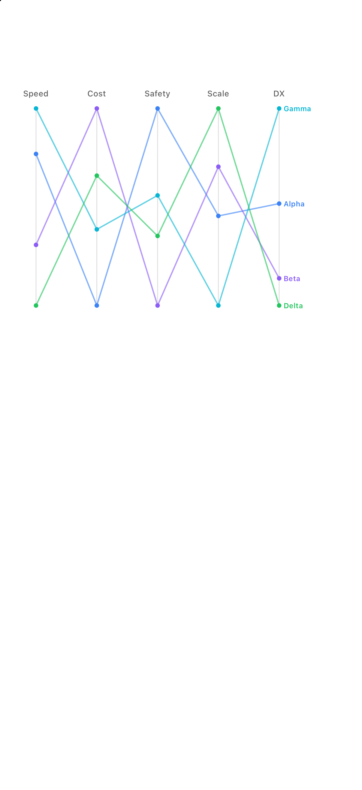 | 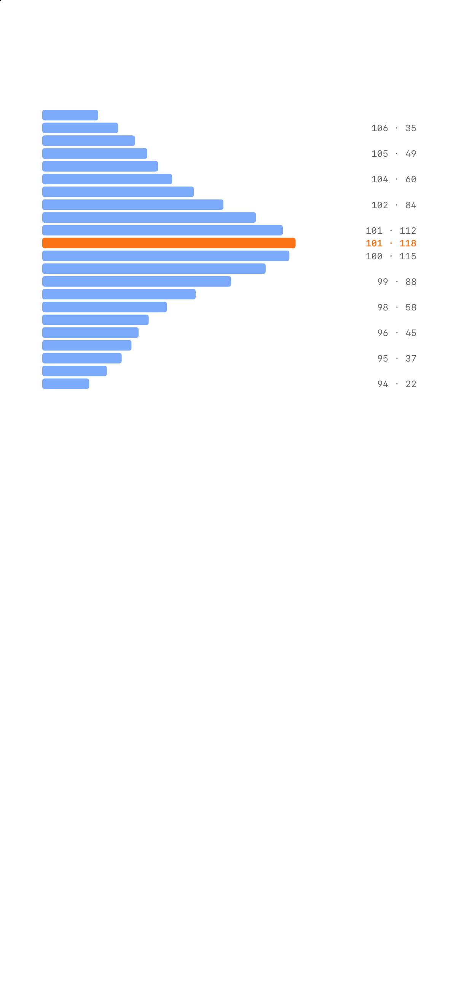 |
|  |  | 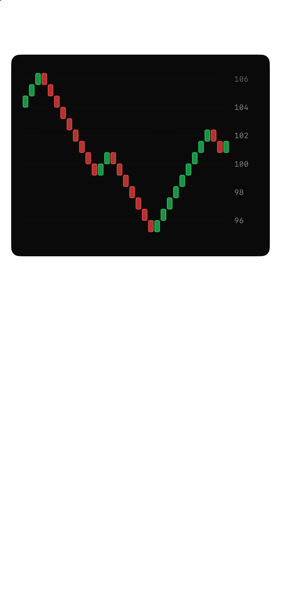 |
| 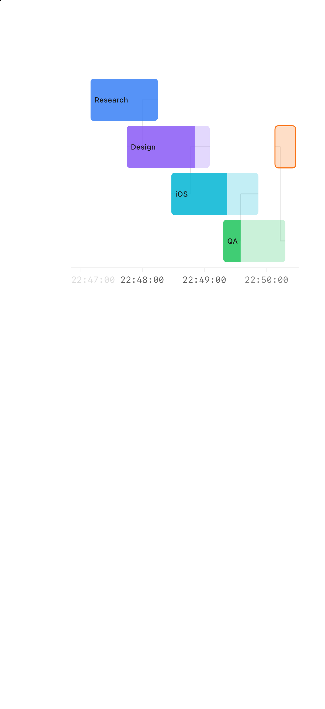 | 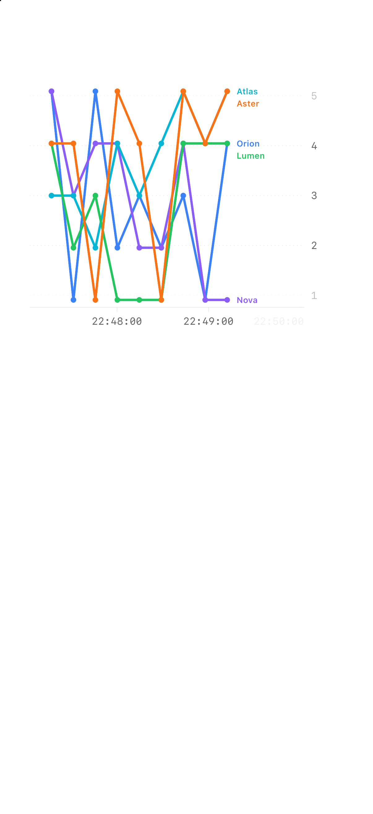 | 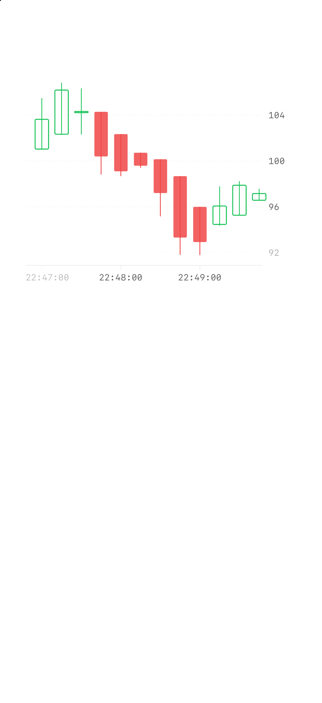 |
| 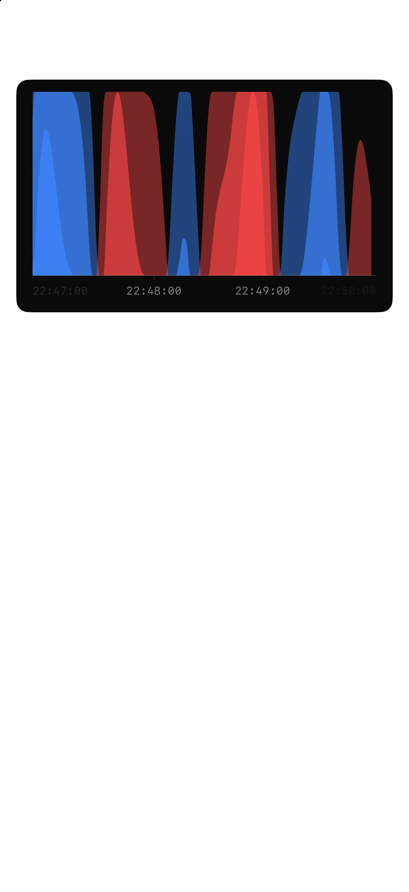 | 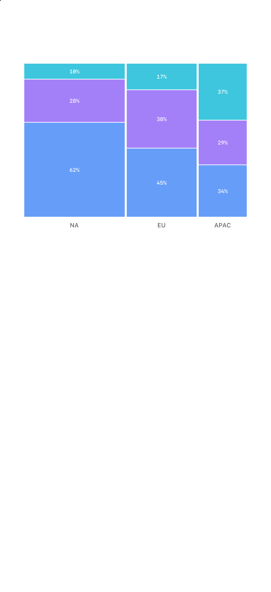 | 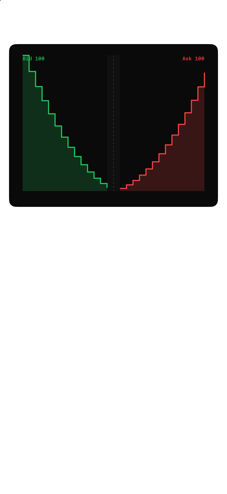 |
| 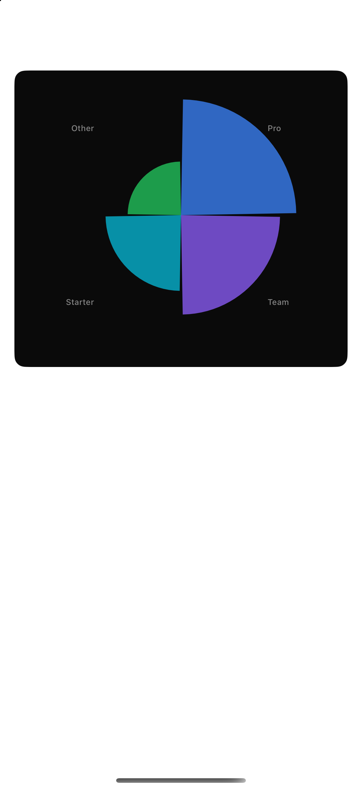 | 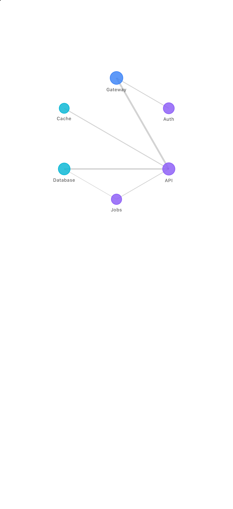 | 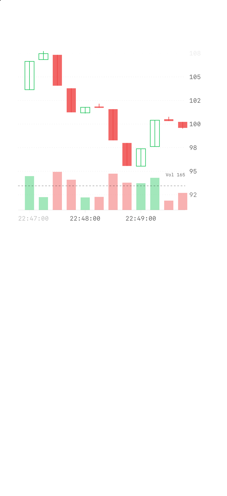 |
|  | 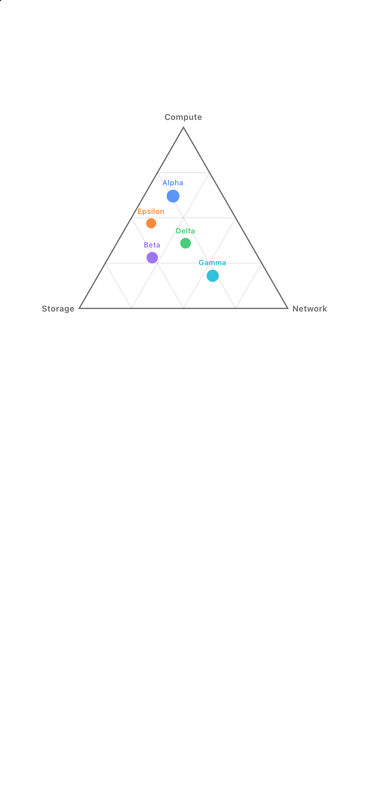 | 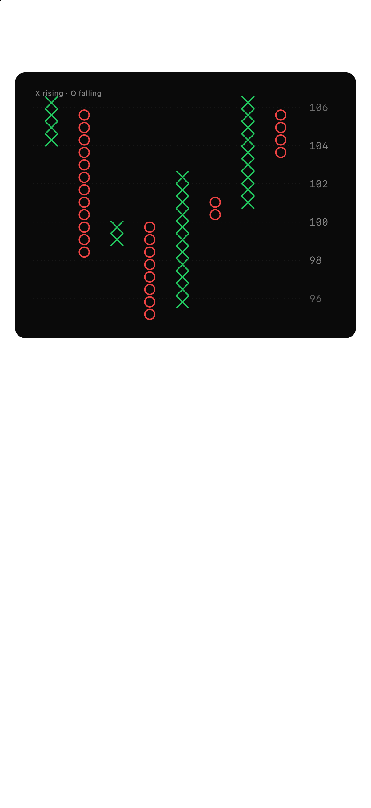 |

## Verification

Run the complete advanced-chart gate:

```bash
scripts/verify-advanced-charts.sh
```

Add `--capture` to refresh the 21 deterministic screenshots before checking their PNG dimensions and presence. See [Chart quality](ChartQuality.md) for the review standard and manual visual loop.
