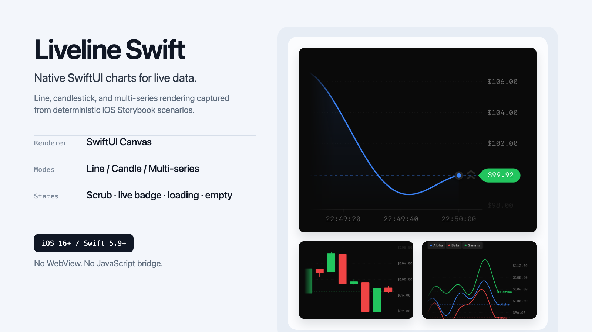
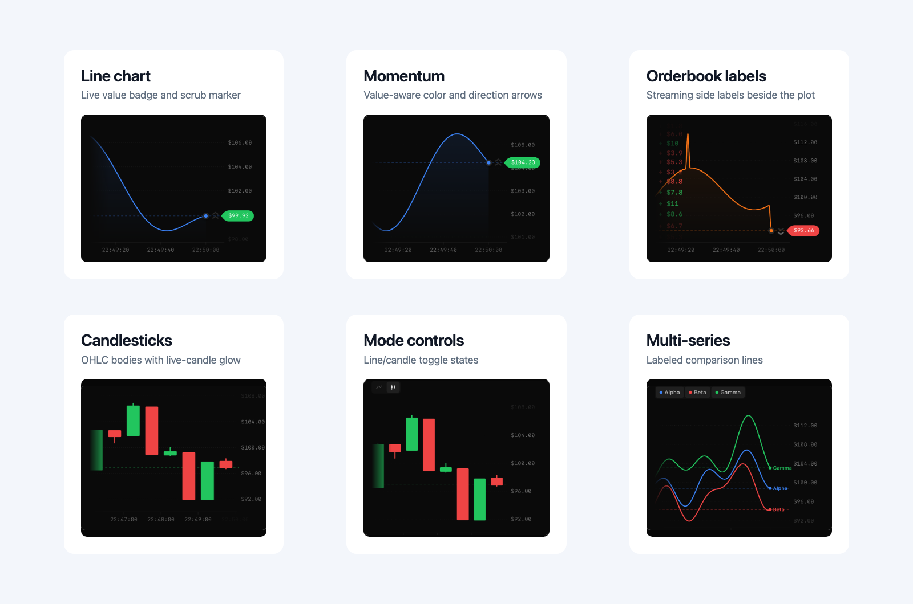
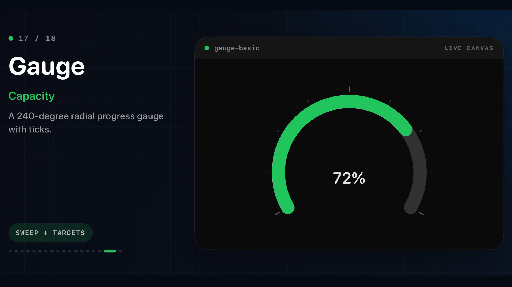

# Liveline Swift

Native SwiftUI real-time charts for iOS apps. Liveline includes line, candlestick, multi-series, bar, range-band, scatter, step, lollipop, bubble, box-plot, waterfall, error-bar, dumbbell, stacked-bar, stacked-area, timeline, heatmap, radar, donut, gauge, and funnel renderers with typed customization.

<p align="center">
  
</p>

This repository is a Swift Package. Any iOS app can add it with Swift Package Manager and import `Liveline`.

## Gallery

These screenshots are captured from the included deterministic iOS Storybook scenarios.

<p align="center">
  
</p>

### Animated chart showcase

[](Media/liveline-chart-showcase.mp4)

The 1080p showcase renders and animates all eighteen additional chart families in the included iOS demo. Regenerate it with `scripts/record-chart-showcase.sh`.

## Requirements

- iOS 16+
- Swift 5.9+
- Xcode 15+

The package also declares macOS 13, tvOS 16, watchOS 9, and visionOS 1 support. The included demo app targets iOS.

## Installation

In Xcode:

1. Open your app project.
2. Select **File > Add Package Dependencies...**
3. Add the repository URL.
4. Choose the `Liveline` product.

In `Package.swift`:

```swift
dependencies: [
    .package(url: "https://github.com/ParthJadhav/liveline-swift.git", from: "0.1.2")
],
targets: [
    .target(
        name: "YourApp",
        dependencies: ["Liveline"]
    )
]
```

If the repository remains private, use a GitHub account or deploy key that can read it.

## Quick Start

```swift
import Liveline
import SwiftUI

struct PriceChart: View {
    let points: [LivelinePoint]
    let latest: Double

    var body: some View {
        LivelineChart(
            data: points,
            value: latest,
            color: .blue,
            configuration: LivelineChartConfiguration(
                theme: .dark,
                window: 60,
                showValue: true,
                valueMomentumColor: true,
                formatValue: { "$" + $0.formatted(.number.precision(.fractionLength(2))) }
            )
        )
        .frame(height: 280)
        .background(Color(red: 10 / 255, green: 10 / 255, blue: 10 / 255))
    }
}
```

Each point uses Unix seconds:

```swift
LivelinePoint(time: Date().timeIntervalSince1970, value: 42125.44)
```

## Chart Modes

Line:

```swift
LivelineChart(data: ticks, value: latest)
    .frame(height: 260)
```

Candlestick:

```swift
LivelineChart(
    data: ticks,
    value: latest,
    candles: candles,
    candleWidth: 60,
    liveCandle: liveCandle,
    lineData: ticks,
    lineValue: latest,
    configuration: LivelineChartConfiguration(lineMode: false)
)
.frame(height: 280)
```

Multi-series:

```swift
LivelineChart(series: [
    LivelineSeries(id: "alpha", data: alpha, value: alphaLatest, color: .blue, label: "Alpha"),
    LivelineSeries(id: "beta", data: beta, value: betaLatest, color: .red, label: "Beta")
])
.frame(height: 260)
```

Bars:

```swift
LivelineChart(
    bars: buckets,
    style: LivelineBarStyle(widthRatio: 0.7, cornerRadius: 3, baseline: 0)
)
.frame(height: 260)
```

Range band:

```swift
LivelineChart(
    range: intervals,
    style: LivelineRangeStyle(fillOpacity: 0.2, showsCenterLine: true)
)
.frame(height: 260)
```

Scatter:

```swift
LivelineChart(
    scatter: observations,
    style: LivelineScatterStyle(symbol: .diamond, connection: .curved)
)
.frame(height: 260)
```

Step and lollipop:

```swift
LivelineChart(steps: levels, style: LivelineStepStyle(position: .center))
LivelineChart(lollipops: changes, style: LivelineLollipopStyle(baseline: 0))
```

Bubble, box plot, and waterfall:

```swift
LivelineChart(bubbles: observations, style: LivelineBubbleStyle(scale: .area))
LivelineChart(boxPlots: summaries, style: LivelineBoxPlotStyle(fillOpacity: 0.2))
LivelineChart(waterfall: deltas, style: LivelineWaterfallStyle(initialValue: 100))
```

Uncertainty, comparison, and stacks:

```swift
LivelineChart(errorBars: estimates, style: LivelineErrorBarStyle(pointSymbol: .diamond))
LivelineChart(dumbbells: comparisons, style: LivelineDumbbellStyle(showsDirection: true))
LivelineChart(stackedBars: stacks, style: LivelineStackedBarStyle(mode: .normalized))
LivelineChart(stackedAreas: stacks, style: LivelineStackedAreaStyle(colors: palette))
```

Intervals and matrices:

```swift
LivelineChart(timeline: work, style: LivelineTimelineStyle(showsLabels: true))
LivelineChart(heatmap: cells, style: LivelineHeatmapStyle(rowLabels: regions))
```

Radial and categorical charts:

```swift
LivelineChart(radar: profile, style: LivelineRadarStyle(range: 0...100))
LivelineChart(donut: mix, style: LivelineDonutStyle(innerRadiusRatio: 0.65))
LivelineChart(gauge: 72, range: 0...100, style: LivelineGaugeStyle(target: 80))
LivelineChart(funnel: stages, style: LivelineFunnelStyle(showsValues: true))
```

## Features

- SwiftUI `Canvas` rendering, no WebView and no JavaScript bridge
- Smooth live value interpolation and range easing
- Monotone cubic line paths to avoid overshoot
- Time-window controls
- Drag scrubbing with tooltips
- Live value badge and pulse dot
- Momentum coloring and arrows
- Optional particle burst and shake effects
- Loading/empty morph states
- Candlestick drawing with live candle glow
- Multi-series toggles
- Signed bar charts with configurable baseline, width, rounding, and colors
- Range bands with configurable fill, boundaries, and center line
- Scatter plots with circle, square, or diamond symbols and optional connections
- Step charts with leading, centered, or trailing transitions and optional fill
- Lollipop charts with configurable baselines, stems, head symbols, and signed colors
- Bubble charts with area or diameter magnitude scaling
- Time-based box plots with normalized five-number summaries
- Cumulative waterfall charts with signed colors, connectors, and configurable initial value
- Error bars with capped bounds and configurable estimate symbols
- Dumbbell comparisons with endpoint colors and optional direction chevrons
- Signed or normalized stacked bars and stacked areas with custom segment palettes
- Multi-lane timelines with interval labels and lane guides
- Time-row heatmaps with labels, intensity ranges, and optional cell values
- Radar charts with configurable domains, grid levels, labels, fill, and markers
- Donut charts with configurable ring thickness, gaps, palettes, and labels
- Radial gauges with custom sweeps, tracks, ticks, targets, and value labels
- Funnel charts with configurable widths, spacing, palettes, labels, and values
- Reference line and orderbook stream labels

## Example App

The iOS demo lives in `Examples/LivelineDemo`.

```bash
cd Examples/LivelineDemo
xcodegen generate
open LivelineDemo.xcodeproj
```

The generated project uses the local package path (`../..`). CI builds this demo target as an iOS simulator app.

## Demo Recording

A current simulator recording is available at [Media/liveline-demo.mp4](Media/liveline-demo.mp4).

To regenerate it:

```bash
scripts/record-demo.sh
```

## Verification

```bash
swift test
swift build -c release
xcodebuild -scheme Liveline -destination 'generic/platform=macOS' build
xcodebuild -project Examples/LivelineDemo/LivelineDemo.xcodeproj -scheme LivelineDemo -destination 'generic/platform=iOS Simulator' build
scripts/capture-storybook.sh
scripts/capture-storybook.sh --chart-only
python3 scripts/build-readme-media.py
scripts/capture-web-references.sh
scripts/diff-storybook.sh --fail-changed-pct 5 --fail-rms 12
```

Use the chart-only capture plus web-reference diff when comparing the native renderer against the upstream React/canvas implementation. Native Storybook captures use deterministic snapshot timing, README media is built from `Media/storybook-chart-only`, and diff panels are written to `Media/storybook-diff`.

The normal CI workflow runs package tests and the iOS demo build. The manual `Visual Parity` workflow captures upstream/native Storybook screenshots, runs the diff gate, and uploads the visual artifacts.

## Release

For release verification and tagging:

```bash
swift test
swift build -c release
xcodebuild -scheme Liveline -destination 'generic/platform=macOS' build
xcodebuild -project Examples/LivelineDemo/LivelineDemo.xcodeproj -scheme LivelineDemo -destination 'generic/platform=iOS Simulator' build
scripts/capture-storybook.sh --chart-only
scripts/diff-storybook.sh --fail-changed-pct 5 --fail-rms 12
```

See [Docs/Publishing.md](Docs/Publishing.md) for the release checklist. Repository visibility is intentionally left unchanged by the release process.

## Documentation

- [API overview](Docs/API.md)
- [Animation model](Docs/Animations.md)
- [Example recipes](Docs/Examples.md)
- [Scenario matrix](Docs/ScenarioMatrix.md)
- [Visual parity status](Docs/ParityStatus.md)
- [Publishing checklist](Docs/Publishing.md)
- [Changelog](CHANGELOG.md)

## Attribution

Liveline Swift is a native Swift implementation inspired by [benjitaylor/liveline](https://github.com/benjitaylor/liveline). It does not embed the original React/canvas implementation.
